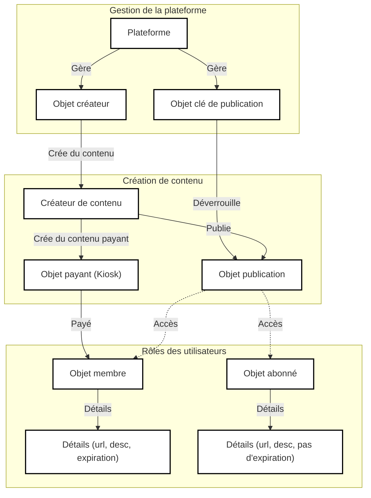

# open-content-protocol

## Aperçu

Le Protocole de contenu ouvert (OCP) est une plateforme de contenu décentralisée basée sur la blockchain Sui. Il vise à fournir un réseau de valeur de contenu décentralisé et résistant à la censure pour les fournisseurs de contenu et les créateurs individuels.

## Architecture

## Fonctions du contrat intelligent

### Créer un créateur

` sui client call --package <package_id> --module ocp_creator --function mint_creator --args <url> <description> <avatar> <member_prices> --gas-budget <gas_budget> `

### Mettre à jour les informations du créateur

` sui client call --package <package_id> --module ocp_creator --function update_creator --args <creator_id> <url> <description> <avatar> --gas-budget <gas_budget> `

### Créer une publication

` sui client call --package <package_id> --module ocp_creator --function mint_post --args <creator_id> <url> <description> <access_level> --gas-budget <gas_budget> `

### Mettre à jour les informations de la publication

` sui client call --package <package_id> --module ocp_creator --function update_post --args <post_id> <url> <description> <access_level> --gas-budget <gas_budget> `

### Créer une clé d'accès à la publication (PostKey)

` sui client call --package <package_id> --module ocp_creator --function mint_post_key --args <post_id> <access_level> <owner> --gas-budget <gas_budget> `

### Créer un contenu payant

` sui client call --package <package_id> --module ocp_paid --function mint_paid --args <creator_id> <url> <description> --gas-budget <gas_budget> `

### Demander un contenu personnalisé (Kiosk)

` sui client call --package <package_id> --module ocp_paid --function request_custom_paid --args <creator> <description> <payment> --gas-budget <gas_budget> `

### Livrer le contenu personnalisé (Kiosk)

` sui client call --package <package_id> --module ocp_paid --function fulfill_custom_request --args <kiosk_id> <request_id> <url> --gas-budget <gas_budget> `

### Créer un membre (Member)

` sui client call --package <package_id> --module ocp_member --function mint_member --args <creator> <url> <description> <avatar> <clock_id> --gas-budget <gas_budget> `

### Renouveler l'adhésion

` sui client call --package <package_id> --module ocp_member --function renew_member --args <member_id> <creator_id> <price_index> <payment> <clock_id> --gas-budget <gas_budget> `

### Créer un abonné

` sui client call --package <package_id> --module ocp_subscriber --function mint_subscriber --args <creator> <url> <description> <avatar> --gas-budget <gas_budget> `

### Mettre à jour les informations de l'abonné

` sui client call --package <package_id> --module ocp_subscriber --function update_subscriber --args <subscriber_id> <url> <description> <avatar> --gas-budget <gas_budget> `

## Licence

Le Protocole de contenu ouvert (OCP) est publié sous la licence Apache, version 2.0. Voir le fichier [LICENSE](../LICENSE) pour plus de détails.