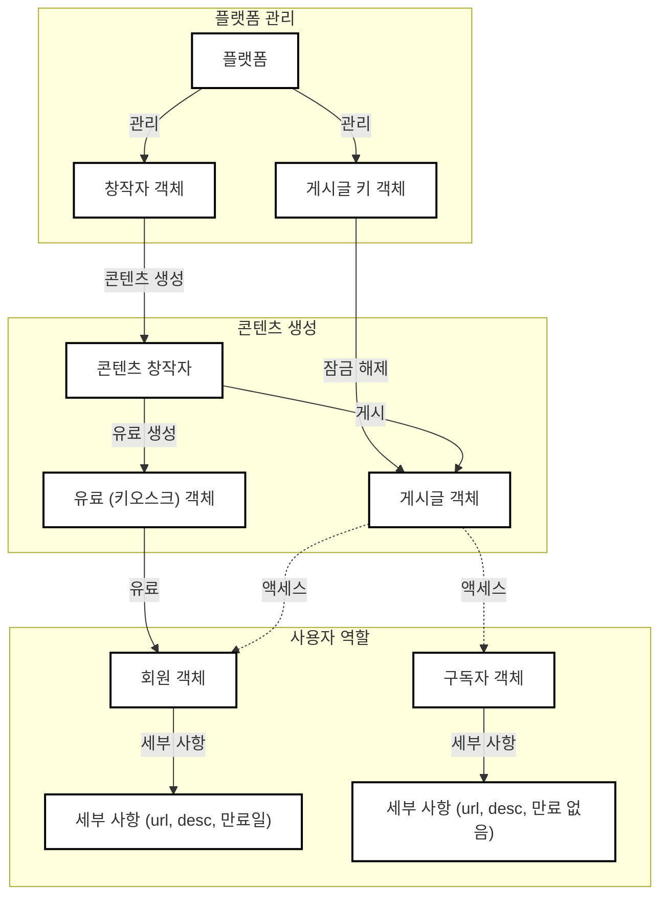

# open-content-protocol

## 개요

이 프로젝트는 Sui 블록체인을 기반으로 하는 콘텐츠 플랫폼으로, 콘텐츠 제공자와 개인 창작자를 위한 탈중앙화, 검열 저항적인 콘텐츠 가치 네트워크를 제공하는 것을 목표로 합니다.

## 아키텍처

## 스마트 계약 함수

### 창작자 생성

` sui client call --package <package_id> --module ocp_creator --function mint_creator --args <url> <description> <avatar> <member_prices> --gas-budget <gas_budget> `

### 창작자 정보 업데이트

` sui client call --package <package_id> --module ocp_creator --function update_creator --args <creator_id> <url> <description> <avatar> --gas-budget <gas_budget> `

### 게시글 생성

` sui client call --package <package_id> --module ocp_creator --function mint_post --args <creator_id> <url> <description> <access_level> --gas-budget <gas_budget> `

### 게시글 정보 업데이트

` sui client call --package <package_id> --module ocp_creator --function update_post --args <post_id> <url> <description> <access_level> --gas-budget <gas_budget> `

### 게시글 액세스 키 생성 (PostKey)

` sui client call --package <package_id> --module ocp_creator --function mint_post_key --args <post_id> <access_level> <owner> --gas-budget <gas_budget> `

### 유료 생성

` sui client call --package <package_id> --module ocp_paid --function mint_paid --args <creator_id> <url> <description> --gas-budget <gas_budget> `

### 맞춤형 콘텐츠 요청 (Kiosk)

` sui client call --package <package_id> --module ocp_paid --function request_custom_paid --args <creator> <description> <payment> --gas-budget <gas_budget> `

### 맞춤형 콘텐츠 전달 (Kiosk)

` sui client call --package <package_id> --module ocp_paid --function fulfill_custom_request --args <kiosk_id> <request_id> <url> --gas-budget <gas_budget> `

### 회원 생성

` sui client call --package <package_id> --module ocp_member --function mint_member --args <creator> <url> <description> <avatar> <clock_id> --gas-budget <gas_budget> `

### 회원 갱신

` sui client call --package <package_id> --module ocp_member --function renew_member --args <member_id> <creator_id> <price_index> <payment> <clock_id> --gas-budget <gas_budget> `

### 구독자 생성

` sui client call --package <package_id> --module ocp_subscriber --function mint_subscriber --args <creator> <url> <description> <avatar> --gas-budget <gas_budget> `

### 구독자 정보 업데이트

` sui client call --package <package_id> --module ocp_subscriber --function update_subscriber --args <subscriber_id> <url> <description> <avatar> --gas-budget <gas_budget> `

## 라이센스

이 프로젝트는 Apache 2.0 라이센스 하에 배포됩니다. 자세한 내용은 [LICENSE](../LICENSE) 파일을 참조하십시오.