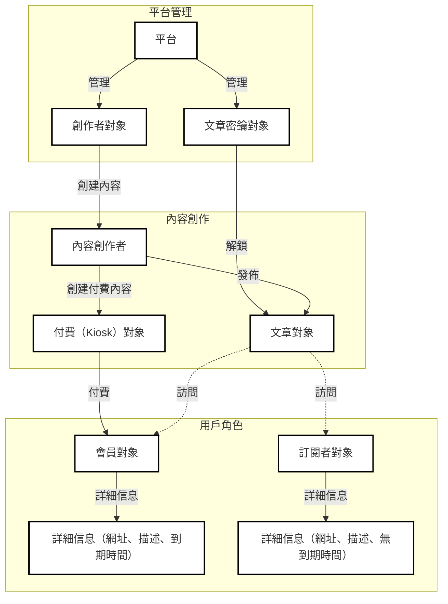

# open-content-protocol

## Overview

開放內容協議 (OCP) 是一個基於 Sui 區塊鏈的去中心化內容平台。它旨在為內容提供者和個人創作者提供一個去中心化、抗審查的內容價值網絡。

## Architecture

## 智能合約函數

### 創建創作者

` sui client call --package <package_id> --module ocp_creator --function mint_creator --args <url> <description> <avatar> <member_prices> --gas-budget <gas_budget> `

### 更新創作者信息

` sui client call --package <package_id> --module ocp_creator --function update_creator --args <creator_id> <url> <description> <avatar> --gas-budget <gas_budget> `

### 創建文章

` sui client call --package <package_id> --module ocp_creator --function mint_post --args <creator_id> <url> <description> <access_level> --gas-budget <gas_budget> `

### 更新文章信息

` sui client call --package <package_id> --module ocp_creator --function update_post --args <post_id> <url> <description> <access_level> --gas-budget <gas_budget> `

### 創建文章訪問密鑰（PostKey）

` sui client call --package <package_id> --module ocp_creator --function mint_post_key --args <post_id> <access_level> <owner> --gas-budget <gas_budget> `

### 創建付費內容

` sui client call --package <package_id> --module ocp_paid --function mint_paid --args <creator_id> <url> <description> --gas-budget <gas_budget> `

### 請求定製內容（Kiosk）

` sui client call --package <package_id> --module ocp_paid --function request_custom_paid --args <creator> <description> <payment> --gas-budget <gas_budget> `

### 交付定製內容（Kiosk）

` sui client call --package <package_id> --module ocp_paid --function fulfill_custom_request --args <kiosk_id> <request_id> <url> --gas-budget <gas_budget> `

### 創建會員（Member）

` sui client call --package <package_id> --module ocp_member --function mint_member --args <creator> <url> <description> <avatar> <clock_id> --gas-budget <gas_budget> `

### 續費會員

` sui client call --package <package_id> --module ocp_member --function renew_member --args <member_id> <creator_id> <price_index> <payment> <clock_id> --gas-budget <gas_budget> `

### 創建訂閱者

` sui client call --package <package_id> --module ocp_subscriber --function mint_subscriber --args <creator> <url> <description> <avatar> --gas-budget <gas_budget> `

### 更新訂閱者信息

` sui client call --package <package_id> --module ocp_subscriber --function update_subscriber --args <subscriber_id> <url> <description> <avatar> --gas-budget <gas_budget> `

## 許可證

開放內容協議 (OCP) 採用 Apache License 2.0 版本發布。有關更多詳細信息,請參閱 [LICENSE](../LICENSE) 文件。